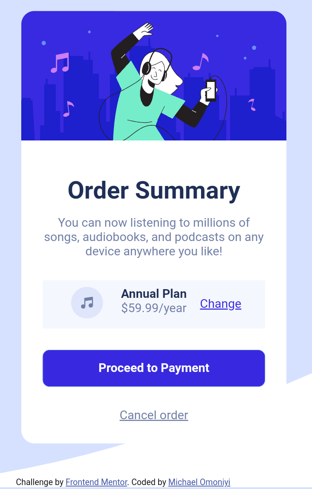

# Frontend Mentor - Four card feature section solution

This is a solution to the [Four card feature section challenge on Frontend Mentor](https://www.frontendmentor.io/challenges/four-card-feature-section-weK1eFYK). Frontend Mentor challenges help you improve your coding skills by building realistic projects. 

## Table of contents

- [Overview](#overview)
  - [The challenge](#the-challenge)
  - [Screenshot](#screenshot)
  - [Links](#links)
- [My process](#my-process)
  - [Built with](#built-with)
  - [What I learned](#what-i-learned)
  - [Continued development](#continued-development)
  - [Useful resources](#useful-resources)
- [Author](#author)
- [Acknowledgments](#acknowledgments)

**Note: Delete this note and update the table of contents based on what sections you keep.**

## Overview

### The challenge

Users should be able to:

- View the optimal layout for the site depending on their device's screen size

### Screenshot




### Links

- Solution URL: [Add solution URL here](https://github.com/MichaelOmoniyi/TECHATON-Project-)
- Live Site URL: [Add live site URL here](https://techathon-omons.netlify.app/)

## My process
I started with the structuring of the mobile view before structuring the desktop view.

### Built with

- Semantic HTML5 markup
- CSS custom properties
- Flexbox

### What I learned

I learnt another use of css flexbox

```css
.container_info3 {
  background-color: hsl(225, 100%, 98%);
  width: 100%;/*rgba(255,182,193, 0.1)  /*hsl(330%, 100%, 52%); /*hsl(351, 100%, 55%);*/
  /*#ffb6c1*/
  display: flex;
  padding: 1rem 0rem;
  margin-top: 1rem;
  border-radius: 10px;
  justify-content: center;
}
```
### Continued development

I'd love to master the use of flexbox better
